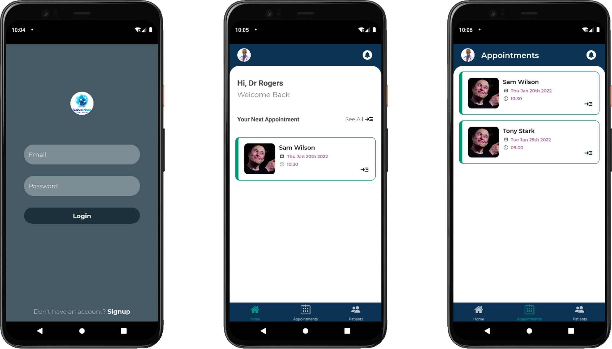

# About Skedula

Skedula is a doctor's appointment scheduling mobile application that is meant to help doctors and patients track and manage their appointments.

# Links

-   [Repo](https://github.com/Goldenbwuoy/skedula "Skedula Repo")

-   [Bugs](https://github.com/Goldenbwuoy/skedula/issues "Issues Page")

# Screenshots

## Doctor's side



</br>
</br>

## Patient's side


</br>
</br>

# Installation

## server

`cd server`

Install dependencies: `npm install`

create a `.env` file and add the following variables:

```
MONGODB_REMOTE_URI=the_uri_to_your_mongodb_database
JWT_SECRET=you_jwt_token_secret_key
```

run locally: `npm run backend`

## app

First, make sure you have Expo CLI installed: `npm install -g expo-cli`

`cd app`

Install dependencies: `npm install`

create a `.env` file and add the server url:

_Note: If you are running on localhost, use http://IP_ADDRESS:PORT/_

```
SERVER_URL=your_backend_url
```

Run Project Locally: `expo start`

# Author

**Golden Mumanikidzwa**

-   Check my [Profile](https://github.com/Goldenbwuoy "Goldenbwuoy")
-   Follow me on [Twitter](https://github.com/Goldenbwuoy "Goldenbwuoy")

## 🤝 Support

Contributions, issues, and feature requests are welcome!

Give a ⭐️ if you like this project!
